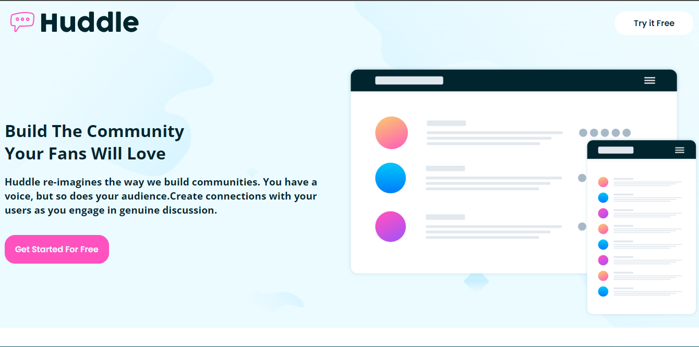
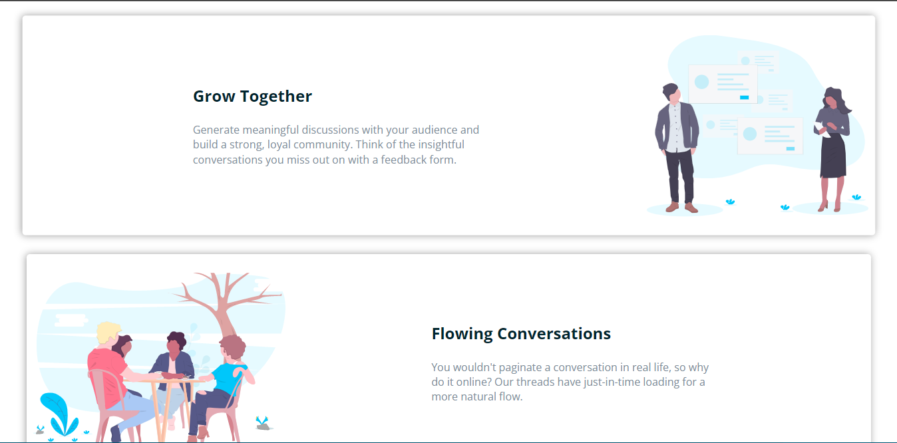

# Frontend Mentor

Esta é uma solução para o desafio Huddle landing page with alternating feature blocks. O objetivo deste desafio é construir e praticar código HTML e CSS puro, bem como praticar o uso do Flexbox, além de praticar as habilidades de layout.

Table of contents
=================

   - [Visão geral](#visao-geral)
      - [O desafio](#o-desafio)
      - [Resultado](#resultado)
   - [Meu processo](#meu-processo)
      - [Construído com](#construido-com)
   - [Autor](#autor)

## Visão geral

### O desafio

Os usuários devem ser capazes de:

- Visualize o layout ideal para o site, dependendo do tamanho da tela do dispositivo
- Veja os estados de foco para todos os elementos interativos na página
 
 ### Screenshot
 
#### Desktop

### Construído com

- Marcação HTML5 semântica
- propriedades personalizadas CSS
- Flexbox

## Autor

- Frontend Mentor - [@the-matheuslima](https://www.frontendmentor.io/profile/the-matheuslima)

